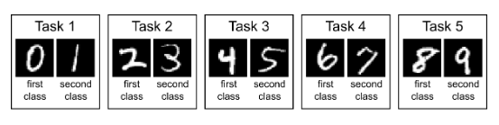
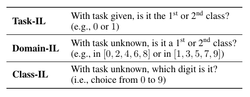
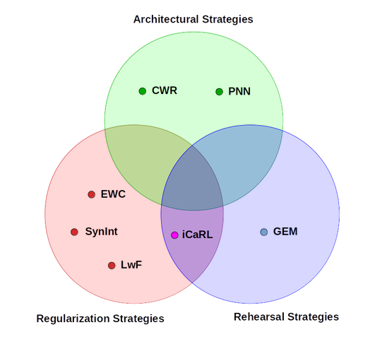
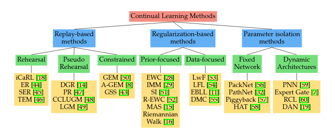

### 概述
尽管近年来深度学习在很多单项任务上取得了相当或超过人类水平的成绩，这些深度学习模型都是为固定的任务所设计，无法动态地根据环境而更新。这意味着每当有来自新的分布的数据输入的时候，此类模型都需要同时在整个历史数据上重新进行训练。显然，在持续变化的现实情境中，进行这种数量级的训练是不现实的。

如果在加入来自新分布的数据时不在旧数据上做上述的重新训练，那么这些针对单一任务的模型很可能会在最近输入的数据上发生过拟合。这种现象被称为**灾难性遗忘 (catastrophic forgetting)**。如果数据本身就存在分布漂移，同样也会发生灾难性遗忘。事实上，灾难性遗忘是深度学习模型所面临的一个更基本的问题的结果：**"stability-plasticity" dilemma**。此处 plasticity 指的是模型融合新的知识的能力，而 stability 即为模型在学习新知识的同时保持就知识的能力。

连续学习 (Continual Learning or Lifelong Learning)，即是一个模型在一个连续序列不同任务上学习的能力。该序列中的新任务通常与旧任务相关联。连续学习旨在防止模型的灾难性遗忘，能够在有效学习新任务的同时维持在历史任务上的表现。连续学习是一个模型适应快速变化的现实情景的关键，对于实现真正的人工智能十分重要。

### 连续学习的情景
为了衡量模型的连续学习能力，人们设计了不同的情景进行评估。论文 "Three scenarios for continual learning" 总结出了以下三种情景：
1. **Task-Incremental Learning (Task-IL)** 在这个情景下，模型在评估时能够得知当前的输入来自于哪一个任务，是最简单的连续学习情景。一个针对 Task-IL 的模型通常会有 **"multi-headed"** 的结构，意味着每一个任务都有独立的输出层，同时其余的网络结构不随任务改变。
2. **Domain-Incremental Learning (Domain-IL)** 与 Task-IL 不同，模型无法在此情景下得知任务的类别，同时模型也不需要判断当前任务所属的具体类别。此情景下的任务都具有同样的结构，但有着变化的输入分布。一个相关实际例子是目标为学习在不同的环境下生存的模型，每一个环境下的结果都是生存和死亡两种，而模型不需要知道自己面对的具体是何种环境。
3. **Class-Incremental Learning (Class-IL)** 在 Class-IL 下，模型需要既能够成功完成给定任务，同时也要判别出任务的具体类别。常见的连续学习问题，如持续加入并学习新的任务类别，就属于这一情形。应用于 Class-IL 的模型使用 **"single-headed"** 的结构，即所有的任务都会使用一个统一的输出层。

我们拿一个常用于评估连续学习的数据集 split MNIST 来更形象地说明以上三种强化学习的情景。split MNIST 把 full MNIST 的训练集切分成包含连续数字的5个子数据集，对应5个不同的任务：学习识别0-10中每两个不同的连续手写数字。

split MNIST 数据集

而下表描述了 split MNIST benchmark 是如何分别用于评估 Task-IL, Domain-IL, 和 Class-IL 情景下的任务的：

对应三种情景的 split MNIST

### 连续学习的方法
目前对于如何实现连续学习有许多不同的方法，据笔者所知暂时没有一个统一认可的分类。CORE50 benchmark 在其[官方文档](https://vlomonaco.github.io/core50/strategies.html)中将连续学习的方法分为了 Architectural Strategies, Regularization Strategies， Rehearsal Strategies 三种：

表示 CORE50 中定义不同类连续学习方法的 Venn 图

而本文将要介绍的是 KU Leuven 和 华为的学者们提出的另外一种类似且更详细的分类方法，同样把连续学习的方法分为了三类：

1. **Replay-based methods** 着手于通过 "replay" 保存下来的训练数据来减轻灾难性遗忘。常用的所谓 "replay" 策略有 *rehearsal* 和 *constrained optimization*。前者即是直接在学习新的任务的同时重新在一些保存下来的历史数据子集上进行训练，代表方法有 iCaRL；而 constrained optimization 则是限制新任务给模型所带来的更新不会负面地影响旧的任务，如 GEM 方法将当前任务计算的梯度投影到旧任务梯度的可行区间内。
2. **Regularization-based methods** 通过在损失函数中添加正则项来在学习新任务的同时保留模型对于之前任务的知识。运用这一策略的方法包括 Learning
without Forgetting (LwF) 和 Elastic Weight Consolidation (EWC) 等。LwF 通过使用新任务的数据计算 distillation loss 来保留对模型旧任务的知识，而 EWC 则试图运用 Fisher Information Matrix 来估计参数对于之前任务的重要性，并最大程度上保持重要参数的更新程度较小。
3. **Parameter isolation-based methods** 基于模型参数不同的子集会在不同的任务上其主要作用这一假设，通过在学习每项任务后冻结一部分参数，并针对新的任务更新其他参数来防止灾难性遗忘。代表方法有 PackNet 等。

表示不同类连续学习方法的树状图（根节点为示例具体方法）

Replay-based methods 需要存储之前任务的训练数据，因此很难应用到较大量级的数据上。Regularization-based methods 只要用到当前任务的训练数据，但在当前任务的数据分布与之前任务的数据分布有较大不同时会出现问题。Parameter isolation-based methods 没有以上两个问题，但会受到任务数量的限制。
  

~~（未完待续）~~
（弃坑了，这两篇文章 [[1]](https://zhuanlan.zhihu.com/p/119324185) [[2]](https://zhuanlan.zhihu.com/p/40328623) 基本把我想写的写得差不多了，我本来也不做这一块。如果有时间再聊聊一个关于 Lottery Tickets Hypothesis 解决 catastrophic forgetting 的 idea）