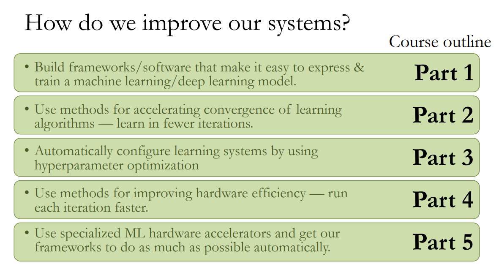

## 为什么写这篇记录？

每当想要了解某门感兴趣的课程时，近可询问上过课的学长学姐，远则登录 [CU Reviews](www.cureviews.org)，[Cornell CS Wiki](https://cornellcswiki.gitlab.io/) 或 reddit 一类网站进行一番查询，可以采用的途径不可谓不多，写这篇文章似乎是有些多余了。然而，这些网站上的 reviews 基本都是由素不相识的人写作的，部分还存在内容过时的问题，读起来难免会有种过于千篇一律而又不够可信的感觉。我便萌生了撰写一个结合亲身经历和个人观点的课程记录的想法。

---
## Fall 2020

本学期主要拿来满足 requirements 和做 research 了，认真上的课就只有以下两门。

### CS 6787 Advanced Machine Learning Systems

**Course Website**: https://www.cs.cornell.edu/courses/cs6787/2020fa/

还不错的 ML Sys 入门课，Chris 的 lecture 生动风趣，选取的 paper 既有像 SVRG 和 Hogwild 这样业界闻名影响深远的，也有 PyTorch 和 TPU 之类与时俱进的，授课内容也从 algorithm for hardware 到 hardware for algorithm 涵盖了 ML Sys 的方方面面，内容参见下图：

 

source: https://www.cs.cornell.edu/courses/cs6787/2020fa/lectures/Lecture1.pdf

与 undergrad 的 CS 课不同，这门课的形式是一半 lecture 一半 paper presentation，作业一般都是 paper review，外加两个简短的 programming assignment 和自己设计的 final project。总之挺 chill 的，也有不少干货，推荐对 ML Sys 感兴趣的小伙伴去上。不想上 graduate course 的朋友也可以选择春季 undergrad 版本的 CS 4787，同样是 Chris 教，下学期我也将担任 TA。

---
### MATH 4310 Linear Algebra

**Course Website**: http://pi.math.cornell.edu/~mike/4310-fa20/info.html

数学系的线性代数，还是那些常规的知识点，不过这回就基本上全都是数学证明了。采用了大名鼎鼎的 
[Linear Algebra Done Right](https://linear.axler.net/) 作教材，Stillman 据说也是个很好的 lecturer（遗憾的是因为时间太早了本人几乎没去上过课）。作业有点多，每周得花上数个小时写证明，考试也并不容易，算是上过的非 honor 数学课里比较能学到东西（也比较不轻松）的。

---
## Spring 2020

### CS 4410 Operating Systems

**Course Website**: https://www.cs.cornell.edu/courses/cs4410/2020sp/

每个 CS 学生都逃不掉的必修课——操作系统，喜欢这个领域的人对它赞不绝口，将其誉为“程序员的三大浪漫”之一（[如何看待程序员的三大浪漫被认为是操作系统、编译原理和图形学？](https://www.zhihu.com/question/27323148?sort=created&page=1))；而 get 不到其中趣味的人则视之充斥着令人头疼的死记硬背，只想着好好学完就万事大吉。很遗憾，我大概更偏向于后一种人。Lorenzo 是 Systems 大牛，但略重的口音让课堂变得有些难懂而枯燥无味，GSH auditorium 暗黄的灯光也让人昏昏欲睡（为了押韵开个玩笑，Lorenzo 绝对是治学严谨、认真负责的好老师）。课程内容就是常规的操作系统基础，从进程管理、各种锁和调度一直讲到文件系统。作业不多，轻松愉快的同时又能实现操作系统的一些基本功能，巩固知识且 chill。

不过这门课的考试就比较不友善了，从 Practice Exams 也可以看出 Lorenzo 的卷子比起 RVR 一般要难上许多，如果没有真的掌握知识就只能自求多福了。另外，这本书的推荐课本 [Operating Systems: Three Easy Pieces](http://pages.cs.wisc.edu/~remzi/OSTEP/) 讲的其实非常好，我觉得甚至可以以课本对应章节为主，听 lecture 为辅来学习这门课，强烈推荐喜欢 os 的同学都去看看，毕竟也是一本挺有名的经典课本了（而且还免费）。我本身 os 学的也不太好，就评价到这里吧。

---

### CS 4120/4121 Introduction to Compilers

**Course Website**: https://www.cs.cornell.edu/courses/cs4120/2020sp/

硬核编译原理，从前端到后端到优化手撸一个编译器，无论是课堂还是作业都干货满满。这门课采用的授课顺序是非常传统的编译器前端->中端->后端->优化的顺序，即 parsing -> semantic analysis -> code generation -> optimization and program analysis -> compiling advanced language features，没有和 Princeton 的 [COS 320](https://www.cs.princeton.edu/courses/archive/spring20/cos320/) 那样先讲 IR 或者 CMU 的 [15-411](http://www.cs.cmu.edu/afs/cs/academic/class/15411-f20/www/index.html) 那样先讲 SSA，具体内容请参照 [course schedule](https://www.cs.cornell.edu/courses/cs4120/2020sp/)。

作业就是要写一个对 Xi Programming Language 的编译器了（[Xi](https://www.wikiwand.com/en/Xi_(letter))，greek letter，读作 /ˈzaɪ/ ~~不要多想啊喂~~）。这是 CS 4120 自创的编程语言，和 C 非常相似，我们的最终目标是要把它编译成 x86，并自选几种 optimizations (dead code elimination, copy propagation etc.) 支持。比较可惜的是因为疫情，这学期删去了做面向对象（Xi++）的支持。至于作业量嘛，我只记得在做 register allocation 的时候整晚对着打印出来的几千行 register 值的变化 debug，一个又一个 segmentation fault 的时候紧盯着 gdb 一步一步地 debug（这里强推 [pwngdb](https://github.com/pwndbg/pwndbg)！比原版好用太多），实现依靠 dataflow analysis 的 optimization 时对着用 Graphviz 画出的 CFG debug，和那无数的 janky fix。。。当然，这些经历带来的收获也是巨大的，有对设计与实现复杂程序的工程能力的提高，也有对从人们打在屏幕上的一段高级语言所构成的代码到真正为计算机所运行的整个转变过程的理解，而更重要的则是对很多以前并未学透彻的计算机系统相关知识和理念进一步深层次的掌握（比如上学期没太学明白的 calling convention）。最后我们运气也不错，水了一个 [Best Compiler](https://www.cs.cornell.edu/courses/cs4120/2020sp/project/bakeoff/) 的奖。

Anyway，慎选 compilers，但选了一定不会让你失望。

---
### MATH 3340 Abstract Algebra

**Course Website**: 略

中规中矩的抽代入门，cover了群环域，但没讲伽罗瓦理论。拿来水一个数学 requirement 还是挺划算的，想认真学抽代建议移步 MATH 4340。

---
### CHILT 2214 Introduction to Classical Chinese II

**Course Website**: 略

文言文课，平时的课程内容就是翻译和鉴赏一些春秋战国时期的古文（如吕氏春秋中的文章）。挺有意思，可以了解一下西方学界是怎么研究中国文言文的，与高中语文课的教法很不一样。给 A 也比较松，还能同时满足 GB 和 HB 的 requirements。

---
## Fall 2019

本学期我仅上了三门课，而且都属于 Cornell 比较经典的 CS 课，简单写下评论吧。

### CS 4820 Introduction to Analysis of Algorithms

**Course Website**: https://www.cs.cornell.edu/courses/cs4820/2019fa/

算法入门课，CS core 之一。此课选用 Tardos & Kleinberg 的经典算法教材 Algorithm Design，而且是 Tardos 亲自授课，挺有牌面。内容基本上就是书上的那些经典算法，比如贪心，动归，分治，NP Complete，停机问题等等，相信高中搞 OI 的小伙伴们学起来会十分轻松。作业分为编程和证明两部分，编程题目一般是要求实现某个经典算法来解决一个简单问题，较为 straight forward；证明有一定难度但花时间基本可以做出，且会随着课程的推进会逐渐变得简单（？）。Prelims 都较为简单，只有 Final 有些难度，Tardos 在考试上还是很友善的。

总之个人认为 Algo 作为 Cornell 一门经典的 CS 必修课，对于内容和难度的平衡做得还是相对较好的，上完此课能够对计算机科学中的经典算法有个初步的掌握。听说春季由 Bobby Kleinberg 教的 CS 4820 涵盖的内容会更深更广，能学到不少东西，想要挑战自己的话可以考虑选择上春季的版本。

最后推荐一下 Princeton 出品的 Algorithm Design 课本的[对应讲义](https://www.cs.princeton.edu/~wayne/kleinberg-tardos/)，用来辅助非常不错。

---

### CS 4780 Machine Learning for Intelligent Systems

**Course Website**: https://www.cs.cornell.edu/courses/cs4780/2019fa/

机器学习入门课，四百多人的大课。主要内容可以被划分为两部分：Classic ML Algorithms，如 KNN, SVM, Naive Bayes, Generative Models等； Learning Theory，如 VC Dimension, PAC Learning, Online Learning, Boosting 等。第一部分由 SVM 大牛 Thorsten 负责，第二部分由刚从 CMU 毕业的做 Learning Theory 的新教授 Nika Haghtalab 负责。总的来说覆盖的内容非常不错，基本涵盖了经典 ML 的方方面面。对于充满公式不利于自学的 Learning Theory，更是提供了一个绝好的入门机会。作业也比较友善，既有 pset 也有 programming assignment，都是三人小组自由组队完成，workload 不大。

然而该课的不足之处也十分明显：缺乏组织性。其中一位教授讲课基本上就是在念 slide 上的内容，漆黑的 slide 背景加上 Statler 昏暗的灯光，实在是令人有些昏昏欲睡。考试内容与作业和 practice exams 也有些存在脱节的现象，想要得高分需要自己下功夫将知识点理解透彻，课程提供不了太多帮助。一些具体的数学内容，如 SVM dual form 的推导和极大似然估计也没有 go over details，反而是 learning theory 部分大都进行了详尽的数学证明，可以发现两位教授的风格十分不同。

综上，此课内容不错，值得一上，不过多半需要做好自学的准备。

---

### CS 3410 Computer System Organization and Programming

**Course Website**: N/A

计算机组成原理，CS core 之一，教你如何造计算机。本学期该课第一次选用 RISC-V 指令集架构进行教学，基本上涵盖了包括 ALU, pipeline processor, calling convention, cache, VM, 以及基础的操作系统等计算机底层的方方面面。Anne Bracy 是个很好的 lecturer，讲课十分清楚不念 slide，且风格随性幽默 (Bracy 本人原先在 Intel 干过，时常在课上黑 x86 和自己的老东家)。作业很具有代表性，基本上都是用 C 或者 Logism 实现 malloc, cache, pipeline processor 等计算机系统组成部分。考试和作业难度都适中，而 Lab 也很好地为作业和考试提供了补充，基本没有什么不满意的地方。

个人认为这门课是我在 Cornell 上过的教学最好的 CS 课程之一，总体来说难度略低于 Nate Foster 教的 CS 3110（也可能是我比较喜欢 CS 3410 lol）。本门课对于今后操作系统、编译原理等偏底层计算机课程的学习非常重要，能够有如此的教学质量可谓是一件幸事了。

---

## Spring 2019

### CS 2802 Discrete Structures - Honors

**Course Website**: http://www.cs.cornell.edu/courses/cs2802/2019sp/

**2019.12.20 Update**: 我下学期将作为这门课的 TA，欢迎大家来上！

CS 2800 离散数学的 honor 版本，本学期第一次开设。内容其实就是普通的离散数学，比 2800 更加深入一些，具体 topics 都可以在[官网](http://www.cs.cornell.edu/courses/cs2802/2019sp/cs2802-19-notes.html)找到。该课采用了 MIT 的教材 [Mathematics for Computer Science](https://courses.csail.mit.edu/6.042/spring17/mcs.pdf)，非常不错，个人认为比 Rosen 的 Discrete Mathematics and Its Applications 写得更好。

这门课的作业一开始有些难度，每周需要花不少时间写证明，但随着课程推进会越来越简单。题目基本都是 proof-based，很少计算题。有两次 prelim 一次 final，都不难。出于这是第一次开设的一门实验性的新课，以后应该还会有许多变化，我的经历参考价值可能并不大。

CS 2802 虽然是 honor，但难度比起 CS 2112 可是差了十万八千里，离散数学本身的知识点（相比数分、线代等）也不具有很高的抽象性，挺好拿分的，大家无需担心，尽可以来上。Joe Halpern 是一个非常好的 lecturer，虽然是 Game Theory 领域大牛却完全没有架子，十分关心学生，讲课也用心准备没有背书，经常与学生互动及询问是否大家都听懂了。有时他也会讲一些自己的研究领域，比如 common knowledge (induction 讲了半节课 puzzle 也是很酷了)，这也是在决定选择上 2800 还是 2802 时可以考虑的一个点。

---

### CS 3110 Functional Programming and Data Structures

**Courser Website**: http://www.cs.cornell.edu/courses/cs3110/2019sp/

不错的教授函数式编程的课，采用 OCaml 作为教学语言。本课依托 OCaml 从函数式编程基本概念和语法开始讲起，覆盖了高阶编程，高级数据结构，解释器，机器证明等内容。一开始的作业都比较简单，到后面逐渐变难，搜索引擎，红黑树，解释器和 async 都是挺 rigorous 的编程训练。

这门课具体怎么样就见仁见智了，据我个人观察身边的朋友对这门课的观点非常 controversial。首先，其对于函数式编程，不可变的数据结构，general 的编程思想和一些诸如解释器、程序证明的计算机领域的介绍做的很好，来上这门课必定可以有很多的收获。但不得不承认的是如果你本身对函数式编程没那么感冒，把它放在第二门或第三门 (Python, Java) CS 课的位置上其实也非必要，毕竟 3110 的知识点与未来的绝大多数其他 CS 课都几乎没有联系，除非将来做 PL research 或去 Jane Street 一类的公司工作，也很少有机会能用到 3110 所学的东西。相对应的，先上 CS 3410 或 CS 4820 也是不错的选择，这些内容在整个计算机知识体系中适用面更广。从难度上论，3110内容很多，想要考高分 workload 便不低，不高的 median 和学生平均水平较高也让大一选择这门课有些压力。当然，我身边也有很多热爱 FP 的聚聚们非常推崇这门课，了解函数式编程也对“编程”，或者说“程序语言”会有更深入的理解，说不定还会激发对范畴论等相关知识的兴趣 orz，各位要有自己的判断。

不过能体验 FP 还是挺不错的，毕竟是一种全新的编程范式。希望自己能够逐渐做到王垠在[*编程的宗派*](http://www.yinwang.org/blog-cn/2015/04/03/paradigms)中所写到的：

> 编程最重要的事情，其实是让写出来的符号，能够简单地对实际或者想象出来的“世界”进行建模。一个程序员最重要的能力，是直觉地看见符号和现实物体之间的对应关系。不管看起来多么酷的语言或者范式，如果必须绕着弯子才能表达程序员心目中的模型，那么它就不是一个很好的语言或者范式。

P.S. 这篇文章挺有意思，推荐各位上了 3110 后去看看。与王垠其他文章一样，寻找它错在哪可以帮助检验自己的学习成果。

---

### STSCI/BTRY 3080 Probability Models and Inference

**Courser Website**: N/A

非常水的统计课，可以用来满足 CS 的统计 requirement。内容主要是随机变量，期望，方差，联合分布，边缘分布，以及其他各种各样的特殊分布，非常基础。作业非常少，而且作业和考试都只有计算题，几乎不需要花时间学习，但也导致学不到什么东西。推荐有需要水课的同学选择，想认真学统计的同学建议除此课外再上一门更加理论的概率统计。

---

### MATH 4130 Honors Introduction to Analysis I

**Courser Website**: N/A

很 rigorous 的数学分析入门，任何想要深入学习数学的同学都推荐选择。话不多说，详见我的另一篇博文：[Baby Rudin Chapter 1-6 总结](http://lixiuyu.cc/2019/05/23/rudin/)。

---

### ASTRO 1102: Our Solar System

**Courser Website**: N/A

在康村的众多水课之中，我的观点一直是：你可以水，但不能浪。

然而 ASTRO 1102 却是如此的与众不同：如果你 S/U，就相当于白赚了 3 分和一个 PBS requirement。

---

### HIST 1431: FWS: Mao, China, World

**Course Website**: N/A

很有意思的一门 FWS，完整地介绍 Mao 的生平和遗产。虽然说本课的目的是让我们正确的认识历史，但不得不说其还是非常以西方主流价值观为导向的。reading 和 essay 都有点多，但喜欢这一部分历史的同学还是非常推荐选择。

这个暑假我正在研读毛选，有兴趣的同学欢迎交流。

---

## Fall 2018

### CS 2112 Object-Oriented Design and Data Structures - Honors

**Course Website**: http://www.cs.cornell.edu/courses/cs2112/2018fa/

非常 hardcore 的 CS 入门课，推荐有一定 CS 基础的同学大一第一学期选择。不过 workload 较大且非常 engineering，喜欢数学多过编程的人可以慎重考虑是否能够同时 handle 这门课和 MATH 2230。

课程概述和分析在我 18 年十二月的博文 [Cornell CS 2112 Review](http://lixiuyu.cc/2018/12/27/CS2112/) 中已经写得很清楚了，感兴趣阅读该文即可。

---

### CS 1998 Introduction to Backend Development

**Course Website:** https://www.cornellappdev.com/intro-to-backend-development

这是由 [Cornell AppDev Project team](https://www.cornellappdev.com/) 的学生开的一门 2 credits S/U 的小课。课程十分轻松，对于求职而言是一个不错的入门。这门课教授了一些后端和数据库的基础知识，并采用 Python 的 Flask 框架和 SQLite 数据库让大家进行实践，诸如 MVC 设计模式等内容也有所涉及。最后会有一个 Hack Challenge，一般为五人一组，会让 Backend 和 AppDev 开设的另外两门课程—— iOS 和 Design 的同学们组队完成一个开放式的 project，对于深入理解与实操后端开发有所帮助。

这门课适用于入门后端开发，了解诸如 Postman, Docker 等工具的使用和 Google Cloud 服务器部署等实用技能，同时 workload 较小，没有 grading 压力，非常推荐。

---

### LING 1101 Introduction to Linguistics

**Course Website**: N/A

非常有意思的语言学入门！强推！LING 1101 涵盖了从 Phonetics, Phonology, Morphology, Syntax, Semantics, Pragmatics 等基础知识到 Language Acquisition，Historical Linguistics, Language Reconstruction 等相关领域，语言学的方方面面基本都有涉及。每一块内容都不会很深入，Workload 也较小，只有每周一份 2-3 pages 的 handout 需要完成。同时对与 CAS 的同学来说，这门课能够满足 distribution requirements 中的 KCM。

这课 lecture 讲过指环王，final 考了克林贡语，可以说是非常酷了。

---

### MATH 2210 Linear Algebra & MATH 2220 Multivariable Calculus

**Course Website**: 略

理论上来讲 MATH 2210 是 MATH 2220 的 prerequisite，但这个规定其实挺扯淡的，国内高数和线代都是一起的呢，有什么理由非要先上线代再上多元微积分 (vector-valued function,  Jacobian 一类的东西，学一学就会了，没必要先上一整套线代)。2210 和 2220 一起上是完全没有问题的，推荐各位采用。这两门课都是最为基础的数学课，2210 大概从线性方程组一路讲到奇异值分解，2220 从基本的多元函数求导讲到格林-斯托克斯公式，具体内容不再赘述，Google 一查基本都能找到相关信息。

2210 的教材为 Linear Algebra and Its Applications，2220 的教材为 Vector Calculus，都能在 [libgen](http://libgen.io/) 里找到。这两门课的教授很多而且基本讲课都是抄书，就不列举了。

2210 和 2220 作为入门数学课我认为还是不错的。2210 在第一次 prelim 之后的内容基本都是 proof-based 的，虽然知识点较为基础，但有助于锻炼写证明的思路。很多人认为 CS 2800/2802 是第一门讲证明方法的课，但我个人感觉如果认真学了 2210，就已经可以应对高阶数学课对 "familiar with writing proofs" 方面的要求了。这也是我在 2210 和 2940（工院线代）中一定推荐 2210 的最主要原因，毕竟有些时候 2940 几乎不讲证明 (如 Fall 2018，Spring 2019 还是 proof-based 的)。 数学课，尤其还是打基础的线代，只注重计算，未免有些违背学数学的初衷了，毕竟再快的速算小能手也比不过 Mathematica，通过证明掌握 high level 的 ideas 才是更重要的。2220 和 1920（工院多元微积分）区别不大，基本只是计算，这也是由微积分本身的性质决定的。想更深入了解微积分可以去修数分，MATH 4130 很不错。

2210 和 2220 因为基本各个专业的学生都会来学，从而拉低了学生的平均水平，因此尽管 median 看起来不高，分还是很好拿的。不要太浪就基本没问题。

---

Fall 2018 我还上了 Jessica Sands 教的 WRIT 1370 (FWS)，对于这门课，我就四个字：水课必上。

