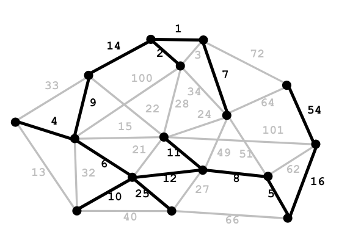

Dijkstra's algorithm 和寻找 minimum spanning tree (MST) 的相关算法都是图论中十分常用而又简洁易懂的算法，但其具体为什么有效仍需要在数学上进行证明。本文即介绍了对这两个数据结构课基础算法的证明，出于我（于写作此文时）没有接受过正规的算法分析训练，如有纰漏或不严谨之处还望斧正。<!--more-->

## Dijkstra's algorithm

Dijkstra's algorithm 是一个可以解决 **single-source shortest path** 问题的经典算法，本质上是对广度优先搜索（BFS）的一个推广，只是把 BFS 维护的 **stack** 换成了 **priority queue** 。鉴于这个算法知名度太高，大家对其都已十分熟悉，这里直接上基于数学归纳法的证明。

我们规定 $G$ 为算法所应用的图，$s$ 是源点，$l(u, v)$ 是从点 $u$ 到 $v$ 的边的长度，$V$ 是图中所有的点的集合，那么 Dijkstra's algorithm 的过程如下所示：

Dijkstra's algorithm

将算法找到的距离记为 $d(v)$ ，从 $s$ 到 $v$ 的实际最短距离记为 $\delta(v)$ ，我们需要证明对任意 $v \in V$ ，在当前轮递推结束时都有 $d(v) = \delta(v)$ 。这等同于证明 $\forall x \in R$ ， $d(x) = \delta(x)$ 。

### Proof By Induction

*Base case ($|R| = 1$)*:  因为 $R$ 的大小会不断增大，只有当 $R = \{s\}$ 时 $|R| = 1$ ，此时 $d(x) = 0 = \delta(x)$ ，正确。

*Induction step*: 令 $u$ 为最后一个加进 $R$ 的顶点，记 $R^{'} = R \cup \{u\}$ ，则 $\forall x \in R^{'}$ ， $d(x) = \delta(x)$ 。

根据 *induction step* 中的条件，$\forall x \in R^{'}$ 且 $x \neq u $ ，$d(x) = \delta(x)$ 。因此，我们只需要证明 $d(u) = \delta(u)$ 。Suppose for the sake of contradiction ，存在一从 $s$ 到 $u$ 的最短路径 $Q$ ，使得

$$
l(Q) < d(u)
$$

我们可以知道 $Q$ 一定不在 $R^{'}$ 内结束，同时部分组成 $Q$ 的顶点在 $R^{'}$ 中。令 $xy$ 为第一个在 $Q$ 中离开 $R^{'}$ 的路径，$Q_x$ 为在顶点 $x$ 结束的 $Q$ 的子路径，则有

$$
l(Q_x) + l(xy) \leq l(Q)
$$

同时，因为 $y$ 与 $x$ 相邻，而结束时最后一个更新的顶点是 $u$ ，故 $y$ 一定被算法更新过。根据 Dijkstra's algorithm ，$d(y) \leq d(x) + l(xy)$ ，所以

$$
d(y) \leq l(Q)
$$

因为 $x \in R^{'}$ ，最后一个被加进 $R^{'}$ 的顶点是 $u$ ，$y$ 则并没有被加进 $R^{'}$ ，我们可以得到

$$
d(u) \leq d(y)
$$

而又由于 $l(Q) < d(u)$ ，我们发现 $l(Q) < d(u) \leq d(y) \leq l(Q)$ ，矛盾。所以 $d(u) = \delta(u)$ ，*induction step* 成立，证毕。

### Another Proof

在我村 CS 2112 的 course note 里还有一个通过 loop invariant 的[证明](http://www.cs.cornell.edu/courses/cs2112/2018fa/lectures/lecture.html?id=ssp)，各位有兴趣的话可以点击链接查看，在此就不展开了。

## Minimum Spanning Tree

最小生成树指的是一副联通加权无向图中权值最小的一棵生成树，而寻找最小生成树（MST）也是图论中非常经典的问题。

A minimum spanning tree of a graph

其中最有名的两个寻找 MST 的算法就是 Kruskal's algorithm 和 Prim's algorithm，思想分别为：

- **Kruskal's algorithm:** 找到一条权值最小的边，如果其与之前选择过的边形成了一个圈（cycle），丢弃这条边，否则留下。
- **Prim's algorithm:** 从任意顶点出发，选择与该顶点所在的连通分支（connected component）相连的不会形成圈的权值最小的边。

事实上，包括以上两个经典算法，寻找 MST 的算法都可以被泛化为一个应用 **Red rule** 和 **Blue rule** 的 **贪心算法**：

- **Red rule:** 记 $C$ 为一个没有红色边的圈，选择一个在 $C$ 中权值最大且未染色的边，将其染成红色。
- **Blue rule:** 记 $D$ 为一个没有蓝色边的割（cut），选择一个在 $D$ 中权值最小且未染色的边，将其染成蓝色。
- **Greedy algorithm:** 应用 red 和 blue rules 直到所有边都被染色，所有蓝色的边则组成了一个 MST

首先，这个算法显然是会终止的，因为任何一个未被染色的边都会和已有的被染过色的集合形成圈或者连通分支，所以其必定落入 red rule 和 blue rule 其中一个的范围中。该算法的正确性（即算法终止时所有蓝色边形成的确实是所在图的最小生成树）同样可以通过数学归纳法来证明。

### Proof by Induction

*Color invariant:* 存在一个 MST $T^{*}$ ，使得 $T^*$ 包含所有的蓝色边且不包含任何红色边。

*Base case*: 当没有任何一条边被染色时，显然 $T^*$ 满足条件，因为不存在任何蓝色边和红色边。

*Induction step 1*: 假设在应用 blue rule 之前，*color invariant* 是正确的。

此时令 $D$ 为被选定的割，$f$ 为被染成蓝色的边，则有以下两种情况：

- $f \in T^*$ ，$T^*$ 满足 invariant。

- $f \notin T^*$ ，记 $f$ 与 $T^*$ 形成的圈为 $C$ （因为 $T^*$ 为图 $G$ 的一棵生成树，$f$ 与 $T^*$ 同在 $G$ 内，$T^* \cup f$ 必形成圈），$e$ 为 $C \cap D$ 除 $f$ 外的另一条边，则 $e \in T^*$。因此，我们可以得到以下两条结论：

  - $e$ 不在任何一个圈中，$e$ 不为红色

  - $e$ 与 $f$ 在同一割中而在应用 blue rule 后被染成蓝色的是 $f$ ，$e$ 不为蓝色且 $w_e \geq w_f$  

  所以 $e$ 没有被染色，且 $w_e \geq w_f$ ，因此 $T^* \cup \{f\} \setminus \{e\}$  才应当是真实的 MST（权值更小），故 $f \in T^*$。

*Induction step 2:* 假设在应用 red rule 之前，*color invariant* 是正确的。

此时令 $C$ 为被选定的圈，$e$ 为被染成红色的边，则有以下两种情况：

- $e \notin T^*$ ，$T^*$ 满足 invariant。

- $e \in T^*$ ，记 $T^*$ 在去掉 $e$ 后形成的割为 $D$ ，$f$ 为 $C \cap D$ 中的另一条边且  $f \notin T^*$（因为一个圈中的顶点都可以互相连通，故其中必有一条边不在所在图的生成树中）。因此，我们可以得到以下两条结论：

  - $f \notin T^*$ ，$f$ 不为蓝色

  - $f$ 与 $e$ 在同一圈中而在应用 red rule 后被染成红色的是 $e$ ，$f$ 不为红色且 $w_f \leq w_e$

  所以 $f$ 没有被染色，且 $w_f \leq w_e$ ，故 $T^* \cup \{f\} \setminus \{e\}$  才应当是真实的 MST，因此我们证明了 $e \notin T^*$ 。

因此，根据算法必定终止且终止时所有边皆会被染色，染成蓝色的边一定属于 $T^*$，染成红色的边一定不属于 $T^*$ ，我们证明了 *color invariant* 成立。所以所有蓝色的边组成了其所在图的 MST ，证毕。

### 再探 Kruskal 和 Prim

在引入了 red rule 和 blue rule 之后，我们可以发现 Kruskal's algorithm 和 Prim's algorithm 其实是这个推广的贪心算法的两个特例。Kruskal's algorithm 和 Prim's algorithm 可以分别被改写成如下形式：

#### Kruskal's algorithm

- 查找未染色的权值最小的边，记为 $e$

- *Case 1:* 如果 $e$ 的两个顶点都在同一颗 blue tree 中，对某个 $e$ 所在的圈应用 red rule ，使得 $e$ 被染为红色

  

  
Case 1

- *Case 2:* 否则应用 blue rule 到一个由所有 blue tree 顶点的形成的割中，使得 $e$ 被染成蓝色 

  

  
Case 2
 

#### Prim's algorithm

- 记 $S$ 为由蓝色的边连接成的树中的顶点的集合

- $S$ 可初始化为任意顶点

- 对由 $S$ 形成的割应用 blue rule

  

  
Prim's algorithm
 

---

以上就是对 Dijkstra's algorithm 和最小生成树相关算法的全部证明。

## References

[1]Cornell University CS 2112 Course Notes. Retrieved from http://www.cs.cornell.edu/courses/cs2112/2018fa/recitations/13mst/rec13-18fa-mst.pdf

[2]Princeton University COS 423 Lecture Notes. Retrieved from http://www.cs.princeton.edu/courses/archive/spr05/cos423/lectures/04mst.pdf

