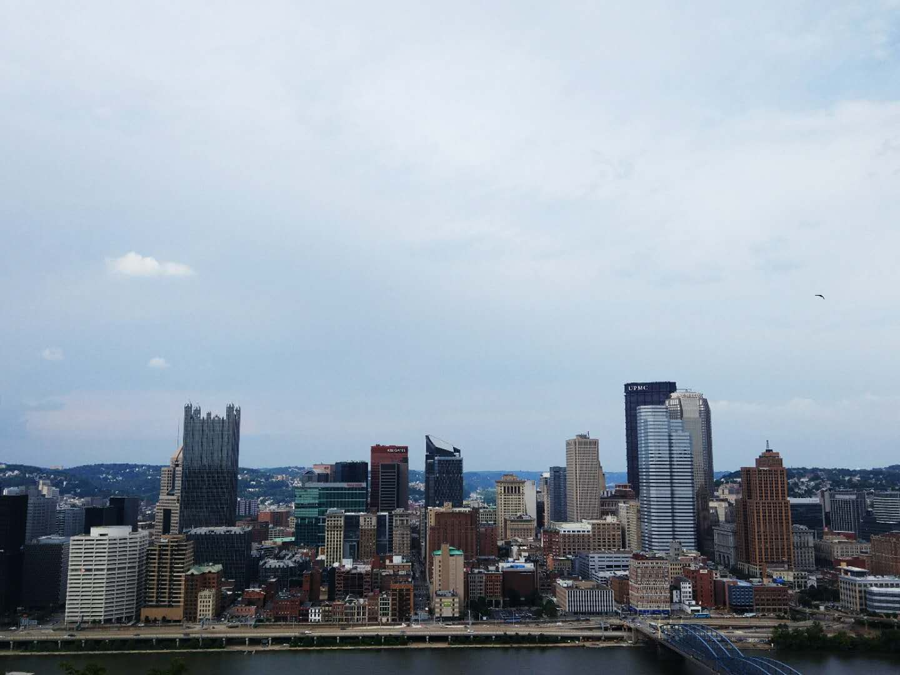
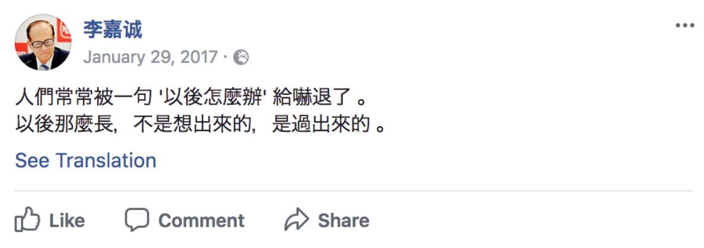

> 尽吾志也而不能至者，可以无悔矣。 
-- 王安石 《游褒禅山记》

今天是一月十二日，距离2017年已经过去了十二天。趁着记忆还算清晰，我想自己确实有必要为这特别的一年写点什么。

 

8/12/2017 16:42 EST in Pittsburgh

<!-- more -->

过去一年里，我对于这个世界的认知，对于自己所想要追求的事物的思考相较以往无论在深度与广度上都不可同日而语。这或许与我从高考到留学的这一转变有关，但我想影响更大的是眼界的开阔与经历的丰富（当然进入留学圈对这两点起到了非常大的促进作用）。未来的一切仍然扑朔迷离，无论怎样试图去梳理，都感觉自己浅薄的想法触及到的都只是水中的倒影，难以捉摸。但比起在过去人生中的混沌一片，却又是好了许多。

现在回看我这一年似乎的确是过得十分充实，凭借着一股“自己选择的路，跪着也要走完”的决心与努力，最后虽然没有去成最初想去的地方，但也已经是非常好的结果了。不过认真想来自己其实本质上并没有什么长进，达成的大部分成就都有很强的功利性的目的，学不到什么真本事。更重要的是很多之前令我无比迷茫的问题仍然困扰着我，如何思考都寻找不到答案。新的困惑也接二连三的产生，更增添了我对自己未来该何去何从的不确定性。最时常伴随我的困扰主要有两个：

首要的便是时常让我倍感绝望，在理想主义与现实主义中摇摆不定的究竟该如何看待天赋的问题。这个难题贯穿着我的整个高中生涯，对我现在的方方面面都有着极为深厚的影响。在经历高一前中期的绝望与自暴自弃，后期重新意识到个人奋斗做到一定程度也可以带来巨大作用（当时看到知乎上 [Xiaodi Hou的回答](https://www.zhihu.com/question/19555355#answer-142781) literally 被震撼了，开始为了必须要做成的事适当牺牲睡眠）和心态的改变（认清天赋和出身已决定自己必然失败的事实但也要尽力冲击那一点渺茫的可能性，算是一种尽人事听天命释然吧），以及最后的来到HFI的客观推动（不再对是否出国犹豫不决从而导致无法决定努力方向），我在2017这一年实际上在尽力地避免继续深思这个问题，替换之的是先用向着短期目标的拼命努力麻木自己，试着解决紧迫的大学问题再做打算。这个方法确实大大减少了我自怨自艾与迷茫而浪费的时间，能去到 Cornell 似乎也代表着问题的解决：只要一直踏实地努力下去就好。

事实恰恰相反。越是顺利，我反而越发地心慌，因为自己其实心里清楚地认识到当前录取的成功只不过是一种假象。毕竟，我在学业上所取得一点小成绩并非真正的智力上的挑战，实际上任何人都可以通过一些技巧与勤奋所达到，只不过是很多人碍于风险不愿去尝试或是不想把自己搞得太累罢了。而一些稍微有点挑战性的东西我却半点都没有做到：想做的项目永远停留在构思阶段（比如某个图像识别的小东西），想完善自己的技术栈、提高编程能力却一直以弄标化 GPA 活动没时间的借口而原地踏步，就连想认真学点数学也是下载完 pdf 就从未翻开过。知乎用户[@江踏歌](https://www.zhihu.com/people/jianghanchen/activities)在他的专栏里写的这段话，用来描述我当前的状况真是再合适不过：

> 我时常感觉到自己智力上和勇气上的缺陷。并且这两种缺陷互相将对方推入更深的泥潭中，永远走不出来，只能勉强维持自己不往下掉而已。
>
> 我虽然也非常想做原创性的工作，比如开发自己的分析工具（一系列复杂的更好的理解自然语言的 topic model、并行化的算法以及炫酷的可视化工具），但这需要巨大的勇气和智力投入，使得我往往还没开头就把任务结束了。事实上，我已经开了超过100次头了。
>
> 但我又时常产生一些幻觉，认为我目前的工作仍然比那些比我层次低的人的工作水平高，而我几乎是将自己全部精力投入到维持这一虚幻的高明的工作上，并且在大部分的时间处于一种沾沾自喜的状态。
>
> 这是一场灾难。明明知道自己的工作其实非常没意思，但是没有勇气，更多的是没有智力上的自信投入到真正创新的工作中去。反而担心自己如果不维持现阶段水准的工作，就会失去更多，永远在患得患失。
>
> 我想这就是智力缺陷者，特别是那些和顶级智商的人差了一个档次的人的局限性。我们永远出不来，只能尽力维持自己工作体现出的智力水准不跌落而已。

我与江踏歌尽管层次不同，心境却是相似的：这一年我虽然做了不少事，熬了许多夜，并时常为取得的成就沾沾自喜，可我做的这些东西，有多少是自己真真正正想做的有意义的事呢？论文在数学大神眼里不值一提，AP 知识浅尝辄止，各类竞赛也远比不上国内比赛的难度。申上 Cornell 又如何？我现在的水平应该比不上任何学科竞赛的省一，更别提能进队、上清北的同学了。我与那些自己所佩服的、真正有实力的人之间的距离一丁儿点都没有减小，却愈发觉得自己更接近于所谓的“智力缺陷者”了。因此，尽管过了一年，我还是会时常诘问自己：“以你的天赋，真的可以支撑做学术的理想吗？”这个困扰，看来得等到上大学后才可能找到答案了。

第二点则是对自己所追求事物的困惑。在 HFI 与留学党这一圈子里见识了各种各样的人与他们所想要的各种各样的活法，感触还是挺深的。第一次发现可供自己的选择路子居然这么多，也让我开始有些迷茫到底是坚持自己的初心还是去更多地尝试其他事物。不过这个话题老生常谈，写出来想必也是索然无味，还是自己去悟吧，暂且略过不提。

总之，2017年依然是不停地怀疑自己的智商，越发感到很多人的天资、努力和取得的成就是自己可望而不可即的，时不时在浅色床单上痛哭的迷惘一年。不过确实也努力了，并幸运地取得了还算不错的成果。这一年的成长与阅历和眼界的丰富，也绝对是之前从未有能相提并论的。现在所能做的，就是不管自己天赋如何，都先别胡思乱想，而是抓住当下，正如香港的一位戴黑框眼镜的长者所言：

继续奋斗下去吧，毕竟我还年轻，热血还没有凉，仍然有足够的青春为自己的理想主义可能犯下的错挥霍。即使最后证明了自己不是学术的这块料，也能够有王文公所言的“尽吾志也而不能至者，可以无悔矣”的感觉吧。

<!-- ### 写在后面

这篇文章从十二日断断续续写到十五日（效率低下╮(￣▽￣)╭），算是我对2017年感想的一个整理，也可以作为我整个高中生涯的总结（毕竟已经是大学生了）。写作的动机呢其实挺复杂的，一直以来都有很多想法想要抒发，加上周围许多同学都开了自己的公众号，便也有意用自己拙劣的文笔来分享自己的所思所想以寻找和引发各位读者的共鸣。但又出于以往一直不善于表达自己的原因，纠结了好一段时间到底写不写这篇文。最终还是决定下笔写出来，毕竟做做总结可以更清晰地审视自己，激励与提醒自己继续不忘初心，奋斗下去。而写文章并发出去，正好也作为进入人生新的阶段一个改变，尝试一下新事物吧。

此外，由于自己未满十八岁写不了公众号TUT，爸妈也不方便提供身份证，便决定提早开放自己的博客，发在上面，作为一个开头语（本来想晚点先能够放些技术干货不显得这么寒酸再公开的，现在啥都没有\_(:з」∠)_）。以后应该什么东西都会写点（学术，随笔，读书笔记 etc.），希望可以坚持下去。 -->

