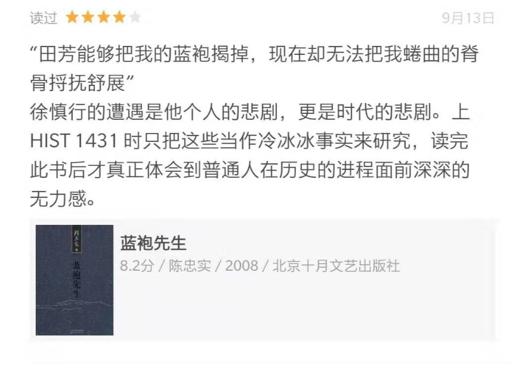

11.18 更新：
在和剧社官方进行一番有意义的交流之后，剧社对本文中指出的一些问题予以认可，并积极地提出了相对应的修改意见。我很赞同和感谢剧社能够持有这样包容开放的精神，这是有助于消除误会，解决问题的正确态度。我也承认出于增强说服力的考虑，本文虽然在对事情经过的叙述和提出的问题与建议整体上秉承公正客观的精神，但也的确在几处地方的描述及比喻有些夸大或不妥（如“一脚踹开”等用词）。总而言之，希望大家都能吸取经验和教训，使得以后我所经历的事情不会再次发生，剧社也能够继续给大家带来精彩的作品。

---

本周《蓝袍先生》小戏演出结束后，我独在 Anabel Taylor Hall 门外道路上徘徊，两位估计是同样看完戏的朋友过来问我道，“你可为为什么突然退出剧组写了一点什么没有？”
我说“没有”。
他们便正告我，“还是写一点罢，大伙儿都很纳闷，怎么出演人员里突然就没有你了。”<!--more-->

所以我决定还是写一些东西。我在演出当周的表现的确没有达到剧社的预期，这毋庸置疑是导致我退出的根本原因；小戏剧组成员们也都相当兢兢业业：在这么多个周日晚上一同排练的四个小时中，各位的付出与汗水我都看在眼里，某位演员在我退出当天发消息给我的安慰也让我十分感动，我真诚地为各位演出的成功感到开心。同样强调一点，我并不反对去努力改变客观环境，但是无论如何不能忽略主观能动性，本文的目的绝不是传达一种发牢骚的气氛，而是想陈述一些客观事实和我内心的想法，希望能给大家带来一些积极的思考。

&nbsp;

我的演习尝试始于9/13/2019，失败于11/13/2019

在演出前一周排练结束后，导演突然告知我：“Eboard 有人在第一次联排的时候就跟我提过，你的演技令人堪忧。现在快要演出了，还是有人持有同样的观点，你可能要和我的角色对调。”当时我便对消息之突然感到十分震惊，但仍觉有一线希望，便加把劲地开始努力练习。然而在周三排练之后导演仍然对我的表现不甚满意，再和他争论一番后我得知若是坚持出演，这部剧将会被强制“冷处理”。这种方式让我十分诧异：难道剧组原来不是真的“开放给所有零基础但对戏剧感兴趣的人”，而是平时一片祥和解放天性的自由表演“fly bitch！”，最后却一脚踹开的“surprise!”吗？我当然不愿整个剧组受我连累，但半推半就换角也索然无味，不如干脆地退出及时止损。事情的经过大体如此。

我不否认我为这部戏付出的时间并不多；我也不否认自己有时自恃记性尚可，对导演讲述的一些毛病和指导没有用笔记下来；我也同意自己没有把演戏看作一个应该自己非常主动地去花很多心思的事情，说得不好听一点这即是没有演员的自我修养。因此，作为主演，对于“临阵换将”这出戏的发生我责无旁贷。但如果这件事的原因仅止于此，那便也是有失公道了：难道筹备一部戏的过程真的和押宝一般，选了角后就平时不加评估地让他自然练习，在临演前发现情况不对才“一刀切”地换掉？

因此，可以发现，除去以上已经说得很完全的我个人责任外，这件事情发生还和主演和剧社沟通渠道不足、信息不对等，以及缺乏一套成熟的管理方案脱不开干系。我一开始加入剧社就是抱着一种试一试的心态，的确没有把演戏当成自己的主业——剧社也没有给我提这样的要求。因为每周课业，求职，project team 和 research 已经占满大部分的时间，我便真真正正把剧社当做一个副业，对自己的要求仅止于完成任务：每周完整利用好四个小时的排练，课外再花一点时间熟悉剧本。我的确完成了任务，也没有人对我的参与程度和进步速度提出过意见——仿佛一切都在按部就班地进行，直到演出前五天。

社员所知道的信息从一开始就是片面的：社员知道自己哪个动作做得不对（会被指出），却不知道自己总体有没有 on the track；社员知道表现不好是个问题，却不知道会没有警告而直接被劝退。筹备一部戏就像管理一个团队项目，诚然，优秀的成员会积极主动为做好项目本身操心，但满意于完成任务不划水的成员也可以说是尽到了责任；而任何一个管理者，都应当有着确保成员拥有对自己当前 performance 以及表现不佳时问责机制知情权的义务。只有这样，成员才能即时地评估自己的投入与回报，在发现未能达标时做出是加大投入还是及时退出团队的决策，以对团队负责。我想，这也算是项目管理应该做到的最基本的要求吧。

在这个剧组里，我就是这么一个愿意完成任务但并不“优秀”的成员，可我却并不能得到及时的反馈（我有没有 on the track，很早之前 Eboard 对我的担忧直到木已成舟才传达到我 etc.）；我愿意为这部剧负责、为剧组负责，如果认为我无法做到剧社要求的 commitment 我会考虑及时退出，可我根本不知情我当前的 commitment 算不算负责。你可以说，积极主动是一个演员最基本的修养；但我是个“演员”的同时，剧社也是一个“社团”，我也未被告知剧社会有这种与众不同的 "naturally constructed high requirements for self-motivation" 的精英性质，在以为自己表现尚可的时候做出 5 hrs / week 的 commitment 决策也无可厚非吧？通过这件事，即便不能说剧社（or 剧组）当前的管理模式“有问题”，我觉得和其他自己参加/管理过的社团/组织/活动相比，是有很大的提升空间的。

临急临忙换演员的结局相信剧社也不希望看到，更不用说每周花了 5 个小时却一无所获的结局我自然也心里不舒服。遇到这种突发的糟心事也不是一次两次了，我完全可以吟两句诗“莫听穿林打叶声，何妨吟啸且徐行”一笑而过。然而，很多不愉快都是双方做出一点改变就完全可以避免的，剧社临近演出换演员也不是只有这一次，着实令人感到十分遗憾。因此，我还是决定写下以上的文章，希望能给大家带来些许启发。秦人不暇自哀，而后人哀之。后人哀之而不鉴之，亦使后人而复哀后人也。
