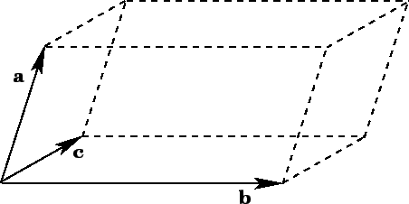

上周五在世史课上做柯斯特利金的代数学引论第一章的习题时，发现了一道有趣的问题：

__证明在三阶行列式展开式中的六项不可能同时为正。__

当时我的第一反应是通过分类讨论来证明六项为正的情况不存在，然而暴力枚举三阶行列式9个元素的所有正负性的情况一共有$2^9 = 512$种组合，不可能通过手算得出。于是我便开始认真思考这个问题，并最后探究出了以下几个有趣的方法和结论。<!-- more -->

## 枚举

首先我还是想继续直观地暴力枚举，试图寻找一些可行的分类方法来降低复杂度。我先从一个三阶行列式 $\det A$ 的计算公式中观察规律：

\begin{align}
\det A &=
\begin{vmatrix}
a & b & c \\\\ 
d & e & f \\\\
g & h & i
\end{vmatrix}
= a(ei - fh) - b(di - fg) + c(dh - eg) = aei + bfg + cdh - afh - bdi - ceg
\end{align}

此时我发现可以通过假设存在全部6项为正的情况，讨论 $a，b，c$ 三项正负性的所有情况，并根据 $a，b，c$ 求出其他项的正负性，继而可得除 $a，b，c$ 外其他元素的同异号关系。如果不论 $a，b，c$ 正负性如何，均存在同异号矛盾则命题得证。由于其他项仅由两个元素相乘，判断同异号关系较为容易。$a，b，c$ 所有正负性情况也只有$2^3 = 8$种情况，而且其中4种情况与剩下4种情况正负性完全相反，根据对称性，在这4种情况中若余下元素的同异号关系产生矛盾，则剩下4种情况同样会出现矛盾。因此，我们只需要讨论4种情况即可，其结果如下表所示：

|                | $ei$ | $fg$ | $dh$ | $fh$ | $di$ | $eg$ |
| -------------- | :--: | :--: | :--: | :--: | :--: | :--: |
| $a,b,c>0$      |  +   |  +   |  +   |  -   |  -   |  -   |
| $a,b>0$, $c<0$ |  +   |  +   |  -   |  -   |  -   |  +   |
| $a>0$, $b,c<0$ |  +   |  -   |  -   |  -   |  +   |  +   |
| $a,c>0$, $b<0$ |  +   |  -   |  +   |  -   |  +   |  -   |

<center><font color=#A9A9A9 size=2>Conditions when all 6 terms are positive</font></center>
通过观察表格可以发现，在所有4种情况中除 $a, b, c$ 外的元素的同异号关系均产生矛盾，具体如下：

- 当 $a,b,c>0$ 时，$i$ 和 $g$ 异号，$g$ 和 $h$ 异号，$h$ 和 $i$ 异号，矛盾
- 当 $a,b>0$，$c<0$ 时，$g$ 和 $h$ 异号，$h$ 和 $i$ 同号，$i$ 和 $g$ 同号，矛盾
- 当 $a>0$，$b,c<0$ 时，$f$ 和 $e$ 异号，$e$ 和 $d$ 同号，$d$ 和 $f$ 同号，矛盾
- 当 $a,c>0$，$b<0$ 时，$d$ 和 $f$ 异号，$f$ 和 $e$ 同号，$e$ 和 $d$ 同号，矛盾

由此可得，三阶行列式展开式中的六项不可能同时为正。为了验证我们的结果，我又写了一个程序来重新暴力枚举一遍所有情况。出于512这个总数对于计算机而言还算小，我就直接无脑写了一个时间复杂度 $\mathcal{O}(n^9)$ 的嵌套循环来达到我们的目的（当然如果有效率更高或可以拓展到 $n$ 阶的代码欢迎各位读者提出）。

```python
# 计算三阶行列式的函数
def determinant3(a, b, c, d, e, f, g, h, i):
    return a * e * i + b * f * g + c * d * h - a * f * h - b * d * i - c * e * g


# 枚举并判断是否存在六项全部为正的情况的函数
def whetherAllPostive():
    # 每个元素只取-1和1来表示正负
    for a in range(-1, 2, 2):
        for b in range(-1, 2, 2):
            for c in range(-1, 2, 2):
                for d in range(-1, 2, 2):
                    for e in range(-1, 2, 2):
                        for f in range(-1, 2, 2):
                            for g in range(-1, 2, 2):
                                for h in range(-1, 2, 2):
                                    for i in range(-1, 2, 2):
                                        # 当且仅当六项全部为正的情况下，三阶行列式值为6；若存在该情况，返回六个元素的值并判定存在
                                        if determinant3(a, b, c, d, e, f, g, h, i) == 6:
                                            return "There exists %d %d %d %d %d %d %d %d %d so that all terms are positive."%(a, b, c, d, e, f, g, h, i)
    # 否则判定不存在
    return "Such condition does not exist."


# 调用该函数并输出结果
print (whetherAllPostive())
```

而最后的输出结果也的确是不存在六项全为正的情况。然而，在我进一步分别把从-6到5的整数都代入到`determinant3(a, b, c, d, e, f, g, h, i)`相等的条件中，发现当每个元素为-1或1时，__三阶行列式的值只能是-4，0，4__。这是怎么回事呢？想要解释这一点，有必要进一步拓展到$n$阶的情况下进行代数证明。

## 代数

一个 $n$ 阶行列式 $\det A$ 的值是由其中一行的 $n$ 个元素分别乘上它们的代数余子式再相加得到。因此，我们从二阶行列式往上推，很容易可以通过数学归纳法得到 $n$ 阶行列式的展开式有 $n!$ 项，同时每一项由 $n$ 个元素相乘得到，具体推导就不在这里展开。如果我们把展开式的每一项乘起来，就会得到一个有 $n\cdot n!$ 项相乘的式子。这个式子还要乘上一个因子$(-1)^\frac{n!}{2}$，因为根据代数余子式的定义（$i$ 行 $j$ 列对应的项的代数余子式要乘一个系数$(-1)^{i + j}$），有一半的项带有一个系数$-1$。

实际上，$n$ 阶行列式的每一个元素在其展开式中出现了 $(n-1)!$ 次，因为若取某任意一个元素，其对应要乘上的代数余子式都有 $(n-1)!$ 项。而我们可以取任意一行或一列来求代数余子式计算 $n$ 阶行列式，最后得出的展开式不变。由此可得，在 $n$ 阶行列式的展开式中，原行列式每一个元素都出现了 $(n-1)!$ 次。从这种角度看，原来的 $n\cdot n!$ 项可被表示为 $n\cdot n\cdot (n-1)!$ 项，而展开式的所有项的乘积也可以得出：


\begin{align}
Product\ of\ all\ terms\ of\ \det A &= a_{11}^{(n-1)!}\cdot a_{12}^{(n-1)!}\cdot\ldots\cdot a_{nn}^{(n-1)!}\cdot (-1)^\frac{n!}{2}\\\\
&=(a_{11}\cdot a_{12}\cdot\ldots\cdot a_{nn})^{(n-1)!}\cdot (-1)^\frac{n!}{2}
\end{align}


因为当 $n\geq2$ 时，$(n-1)!$ 永远是偶数，$(a_{11}\cdot a_{12}\cdot\ldots\cdot a_{nn})^{(n-1)!}$ 的值恒为正。所以展开式所有项乘积的正负性由$(-1)^{\frac{n!}{2}}$决定。当 $n=3$ 时（即三阶行列式的情况），$(-1)^\frac{n!}{2}=-1$，展开式所有项乘积小于0。因此，在三阶行列式的展开式中负数项的个数只能是奇数。出于三阶行列式展开式共有六项，负数项个数只可以取1，3，5。当行列式每个元素只取-1和1时，对应的行列式的值则分别为4，0，-4。因此只存在`determinant3(a, b, c, d, e, f, g, h, i)`等于4，0，-4时的情况。

## 几何

除了用枚举和代数推导，实际上还可以通过行列式的几何意义来证明为什么三阶行列式展开式的六项不能同时为正。不过本人对这一方面涉猎不多，所需背景知识也相对较多，本文只简单拓展一下。此部分内容主要参考[阿達馬的最大行列式問題](https://ccjou.wordpress.com/2013/09/12/%e9%98%bf%e9%81%94%e9%a6%ac%e7%9a%84%e6%9c%80%e5%a4%a7%e8%a1%8c%e5%88%97%e5%bc%8f%e5%95%8f%e9%a1%8c/)这篇文章。

对于 $n\times n$ 阶矩阵 $A$，$|\det A|$ 等于 __$A$ 的列向量（或行向量）于 $\mathbb{C}^n$ 空间所张开的平行（超）多面体体积__。这就是行列式的几何意义，本篇文章不在这里进行证明。



<center><font color=#A9A9A9 size=2>$3\times 3矩阵列向量所张开的多面体$</font></center>
我们把每一个列向量当做平行多面体的边，可以发现当所有列向量两两正交时，平行多面体体积最大，为各方向边长的乘积（这一点在二维的情况下可以直观地看出，当平行四边形是矩形时，也就是两边垂直（代表边的向量正交）时，面积最大，为两个不同方向的边长的乘积。推广到高维同样适用）。这一几何性质可以用一个不等式描述:


<center>$|\det A|\leq\prod\limits_{j=1}^{n}||\boldsymbol{a}_j||$</center>


其中 $\boldsymbol{a}_j$ 代表矩阵 $A$ 的列向量，$||\boldsymbol{a}_j||^2=\sum\limits_{i=1}^n|a_{ij}|^2$。这个不等式被称为 [__Hadamard 不等式__](https://www.wikiwand.com/en/Hadamard's_inequality)。我们继续沿用只给矩阵的元素取-1和1的方法。假设 $n$ 阶行列式的展开式可以所有项同时为正，那么行列式最大值为 $n!$（展开式一共有 $n!$ 项），也即$n \times n$矩阵表示的平行多面体体积最大值为 $n!$。而当每个元素都为1或-1时，易得 $||\boldsymbol{a}_j||^2=\sum\limits_{i=1}^n|a_{ij}|^2=n$。由此可得 $||\boldsymbol{a}_j||=\sqrt{n}=n^\frac{1}{2}$，$\prod\limits_{j=1}^{n}||\boldsymbol{a}_j||=n^\frac{n}{2}$。因此根据 Hadamard 不等式，$n\times n$ 矩阵表示的平行多面体体积最大值为 $n^\frac{n}{2}$。我们可以证明当 $n>2$ 时，$n^\frac{n}{2} < n!$（证明略；可以通过数学归纳法或证明 $\lim\limits_{n\to\infty}\frac{n^\frac{n}{2}}{n!}$ 收敛），所以在 $n>2$ 时，$n\times n$ 矩阵所表示的平行多面体体积必定小于 $n!$，即 $n$ 阶行列式的展开式不可能同时为正。

通过关于行列式的几何意义的方法，我们不仅证明了三阶行列式的展开式不可能同时为正，也推广到了当 $n>2$ 时，$n$ 阶行列式的展开式不可能同时为正。

---

这篇文章虽然讨论的问题和涉及的方法都比较 trivial，但我个人觉得这个问题还是挺有趣的，如果各位有新的方法或者对本文的内容有什么不清楚的地方还请在评论区或通过其他方式与我多多交流。很久没有更文了（接近荒废），就暂时先这样水一篇吧。近期时间逐渐变得充裕，应该会开始稍微频繁一点写blog（如果没有就是我又继续咸鱼了qaq）。