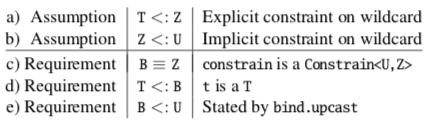

之前 CS 2112 在讲 Java generics 的时候 Professor Kozen 提起过其实 Java 的 type system 是不牢靠的（unsound），并且他的同事 Ross Tate 曾专门为此发了[一篇论文](https://dl.acm.org/citation.cfm?id=2984004)。<!--more-->出于学期中学业繁重，我并未能及时阅读，但一直没有忘记这回事，在回国的飞机上通读了一下（然而大部分并没有看懂），确实挺有意思。本篇文章即是对 Java generics 的 wildcard capture 特性以及为什么其会导致 Java type system unsound 的一个简单介绍，大部分内容来自该论文和 Ross Tate 所写的[相关博客](https://hackernoon.com/java-is-unsound-28c84cb2b3f)。

## Wildcard Capture

在2004年发布的 Java 5 引入了**泛型（generics）**，即“**参数多态（parametric polymorphism）**”，使得一个方法可以接受不同类型的参数。比方说，`List<E>` 代表一个元素都为 type E 的 List。 而**通配符 （wildcard）**，用符号 `?` 表示，作为泛型方法参数时可以代表某种任意类型（具体类型无法在 compile time 判断，甚至有时在 run time 也无法判断）。例如 `List<? extends Number>` 表示一个元素可以是 Number 的任意子类的 List 。 

出于每一个 wildcard 可以表示某种类型，也可以是不同的类型，Java 使用了一种叫做 **wildcard capture** 的方式来对 wildcard 进行类型检测。通过引入一个 **fresh type variable** 来表示任意 wildcard 所描述的 unknown type，再对这个新的 type 进行类型检测，Java 可以实现对 wildcard 的类型检测。举个例子，对于方法 `<E> List<E> reverse(List<E> list) {...}`，开头的 `<E>` 表示这个方法可以应用于任意类型 E 。当 `ns` 为 `? extends Number` 类型时，  Java 会对 `reverse(ns)` 进行以下几步类型检测：

1. 判断 ns 是 `List<? extends Number>` 类型
2. 因为这个类型有一个 wildcard 参数，引入一个 fresh type variable，X，来表示 wildcard
3. 更改 wildcard 参数为 X，使得 `List<? extends Number>` 变为 `List<X>`
4. 检测 `reverse` 的参数类型是否为 `List<X>`

因此，`reverse(ns)` 将会返回一个类型为 `List<X>` 的结果。但仅仅通过这个结果，我们无法得知关于 X 的任何信息。事实上，除了以上的步骤，wildcard capture 还有以下两步来对 X 添加限制：

- **Explicit Constraint** 在上例的 wildcard 中，`? extends Number` 表明该 wildcard 被限制为 Number 的子类。新引入的 fresh type variable，X，也被添加了必须是 Number 的子类的限制。所以根据这一 explicit constraint， JVM 知道任何 `List<X>` 的元素都是 Number 的子类。

- **Implicit Constraint** 有时除了 explicit constraint，wildcard 还会被添加一个比较隐式的限制。以下例子可以更好地帮助我们理解什么是 implicit constraint：

  ```java
  class Numbers<N extends Number> extends List<N> { 
    public N totalSumOfValues() {...}
  }
  ```

  假设我们有类型为 `Numbers<?>` 的参数 `nums` 作为 `reverse()` 的参数，对于结果 `reverse(nums)` 的类型 Y（新引入的 fresh type），我们知道些什么呢？因为 `Numbers<?>` 中的 `?` 可以是任意类型，我们无法从 explicit constraint 中得到任何信息。但我们从 `Numbers` 的定义中可以得知，任何一个 `Numbers` 的合法参数 `N` 都必须是 Number 的子类。我们称 `N` 被 implicitly 限制为 Number 的子类。所以我们 `Numbers<?>` 中的任意类型 `?` 也被加上了必须为 Number 子类的 implicit constraint。同样地，JVM 也得知 fresh type Y 也必定是 Number 的子类。

以上就是对 Java generics 中的 wildcard capture 机制的介绍。

## 何为 sound

大部分编程语言的 type systems 的目标是对一个 "well-typed" 的程序应该如何表现提供某种保证。比如，在大部分编程语言中，一个 well-typed 的程序对内存的使用应该是“安全”的。**如果一个 type system 成功提供了这样的保证，那我们称这一 type system 是 "sound" 的**。举一个最简单的例子，对 Java 而言，考虑以下伪代码：

```java
public Integer increment(Integer i) { return i + 1; }
String countdown = increment(“98765432”);
```

显然，Java 的 type system 会拒绝这段代码的执行（丢出一个 exception），因为 Java 的 type system 会保证如果一个方法要求的参数类型是 Integer，那么它接受的参数类型永远只能是 Integer，而不是 String 。在某些其他例子中，情况会稍微复杂一些：

```java
List<Integer> ints = Arrays.asList(1);
List raw = ints;
List<String> strs = raw;
String one = strs.get(0);
```

这段代码也是不应该被允许的，因为一个指定元素类型为 String 的 List 不应该可以得到一个类型为 Integer 的元素。然而，Java 在 compile time 并不会对这一段代码报错（本人也使用了 Intellij Java 10进行验证）。这是因为尽管在这个例子中这种情况显然是不好的，但在很多其他例子中，这样的一种“包容性”其实是有益处的。毕竟，**"untyped languages are all about allowing bad things to happen so that more cool things can happen as well"** 。不过，Java 在 runtime 执行 `get()` 指令时会再一次检测 List 中的元素是否为 String，从而发现本例中的代码应当被拒绝执行，并丢出相应的 exception （此处为 `ClassCastException`），避免出现安全问题。

## More Unsoundness in Java

尽管在上例中 Java 在 runtime 成功发现了代码中的错误，没有在 type check 阶段就发现错误仍然是十分危险的。在 runtime 才丢出 Exception 只能说是运气好，因为如果历史变得稍有不同，比如 Java 在添加 generics 时不会检测类型的向后兼容性，或 Java 在第一次释出时就已经引入了 generics，**那么这个 Exception 很有可能就不会被丢出，从而导致严重的安全隐患，例如在内存中访问了一个不存在的 field** 。下面有一个更加复杂的例子来体现 Java 的 unsoundness：

```java
class Unsound {
  static class Constrain<A, B extends A> {}
  static class Bind<A> {
    <B extends A>
    A upcast(Constrain<A,B> constrain, B b) {
      return b;  
    }
  }
  static <T,U> U coerce(T t) {
    Constrain<U,? super T> constrain = null;
    Bind<U> bind = new Bind<U>();
    return bind.upcast(constrain, t);
  }
  public static void main(String[] args) {
    String zero = Unsound.<Integer,String>coerce(0);
  }
}
```

为了对以上代码进行 Type-argument inference ，Java 会先收集已知的假设和需要满足的要求，并根据这些限制条件来尝试决定是否存在一个合法的参数。在此例中，一共有以下的假设和需求：



首先 `Constrain<U, ? super T>` 中有一个 wildcard 参数，所以通过 wildcard capture，Java 引入了一个 fresh type variable，Z 。显然，这个 wildcard 有个 explicit constraint，即 T 是 Z 的子类。同时根据 `Constraint` 的定义 `Constrain<A, B extends A>` ，这里还有一个 implicit constraint，即 Z 是 U 的子类。由此可得 Assumption a) 和 b) 。接下来 Java 对 `bind.upcast(constrain, t)` 进行类型检测，此处的 `constrain` 为 `Constrain<U, Z>` ，类似地，由 `upcast`  的定义我们可以知道 B 在句法上等价于 Z ，同时 B 是 U 的子类，得到 c) 和 e) 。同样因为 `upcast` 的定义，`t` 的类型应当是 B 的子类，所以 T 是 B 的子类，得到 d) 。

 由于 c) 的存在，我们可以直接从 a) 和 b) 推出 d) 和 e) 成立。即，explicit constraint 告诉了我们 `t` 是一个合法参数，而 implicit constraint 使得 `bind.upcast` 满足要求。因此，使得 `coerce` 合法的关键在于找到一个具体的 Z ，其满足 `Constrain<U, ? super T>` 。然而，当 T 不是 U 的子类时，是不可能创造出这样的 `Constraint` 实例的（本例即是这种情况，Integer 显然 不可能是 String 的子类）。论文在这里引入了一个概念 *implicit null*，即 "in Java null inhabits *every* reference type"。所以，尽管不可能实例化 `Constrain<U, ? super T>` ，某些 "unsound" 的代码仍然可以通过 null 来通过 type check 的 assumption（因为本人对 type theory 知之甚少，也并不是特别理解这个解释，更无法进一步展开，还望各位读者在评论区指教）。因此理论上这段明显 "unsound" 的程序是满足所有需求的，也的确可以通过 javac, version 1.8.0_25 的编译。但其未能通过 Eclipse Compiler for Java, ecj version 3.11.1.v20150902-1521 和 Java 9, javac build 108 的编译，因为这两个更新的编译器首先考虑了 Requirements d) 和 e) ，并未建立 c)，并发现 t 的类型并不是 U 的子类，参数不合法$^1$。

## Conclusion

 从以上例子可以得出，Java 的 type system 并不牢靠，有时会通过编译 "unsound" 的程序。论文中还给出了另外一个 eclipse 与 Java 9 也能通过编译的 "unsound" 程序，本文不进行展开$^2$。Java 中的 unsoundness 主要是源于引入泛型时的一些疏漏，比如本文所介绍的 wildcard capture 机制相关的几个例子。最后，引用 Professor Tate 写在博客中的一段话来总结为什么我们需要关注 type systems 中基本很少发生的 unsoundness：

> Soundness is a security guarantee, not a usability concern. What matters is if *someone* can write this, because then that someone can get around the security measures that people have placed their confidence in and do whatever they would like to do. In the case of soundness, it’s the malicious programmer you should be worried, not just you and your friends.

---

*注 1* 在用 IntelliJ 测试时，编译器报了一个非常诡异的错误：Z 的范围不符合 `Constrain` 的要求，应当 extends U。然而，它又给出了 Z 的 upper bounds 和 lower bounds 分别是 U 和 T，的确是 U 的子类，令人十分费解。
*注 2* 该可以通过所有三个编译器检测的代码如下：

```java
class Unsound9 {
  static class Type<A> {
    class Constraint<B extends A> extends Type<B> {} 
    <B> Constraint<? super B> bad() { return null; } 
    <B> A coerce(B b) {
      return pair(this.<B>bad(), b).value; 
    }
  }
  static class Sum<T> {
    Type<T> type;
    T value;
    Sum(Type<T> t, T v) {
      type = t;
      value = v;
    }
  }
  static <T> Sum<T> pair(Type<T> type, T value) { 
    return new Sum<T>(type, value);
  }
  static <T,U> U coerce(T t) {
    Type<U> type = new Type<U>();
    return type.<T>coerce(t); 
  }
  public static void main(String[] args) {
    String zero = Unsound9.<Integer,String>coerce(0);
  } 
}
```

 ## References

[1]Nada Amin and Ross Tate. 2016. Java and scala's type systems are unsound: the existential crisis of null pointers. *SIGPLAN Not.* 51, 10 (October 2016), 838-848. DOI: https://doi.org/10.1145/3022671.2984004

[2]Tate, R. (2017, January 24). Java is Unsound: The Industry Perspective – Hacker Noon. Retrieved from https://hackernoon.com/java-is-unsound-28c84cb2b3f

