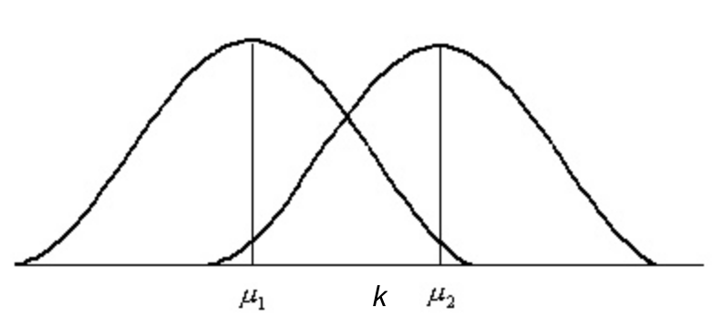

去年在学习AP ~~TI-84/NSPIRE艺术~~统计时，总有一些骚操作让人一头雾水。而每当询问Mr. Z时，他也只是会说“This is an AP level course. You only need to know how to press the calculator.” 本篇文章讨论了几个AP统计中涵盖的公式及比较有意思的知识点背后的原理。

<!-- more -->

*注：本篇文章大部分专业词汇使用英文，以便于读者将它们与AP统计中所学的概念相对应，若对中英文夹杂感到不适还请见谅*

## Sample Variance Formula

在学习sample variance的时候，我对于其计算公式

$$ s_x^2=\frac{1}{n-1}\sum{(x_i-\bar{x})^2}$$

中的$n-1$（而不是$n$）非常不解，而在课本*The Basic Practice of Statistics for AP* 431页单纯通过举例子计算的解释显然是一点帮助也没有。。。不过其提到的一个词*biased estimator*却的确是问题的关键：

**当我们有一个参数为实数$\theta$的概率模型，构造关系$u$，若对任意观测数据$X$，都有**

$E[u(X_1,X_2,\ldots,X_n)]=\theta$

**则我们称 $u(X_1,X_2,\ldots,X_n)$ 是一个对 $\theta$ 的 _unbiased estimator_。否则，$u(X_1,X_2,\ldots,X_n)$ 是一个对 $\theta$ 的 *biased estimator***

对于任意一个服从分布$F$的随机变量$X$，已知$X$的期望为$\mu$，则随机变量$X$或分布$F$的真实方差为

$Var(X) = \sigma^2=E[(X-\mu)^2]$

由此可得

$\displaystyle Var(X)=\sigma^2=E[\frac{1}{n}\sum_{i=1}^{n}(X_i - \mu)^2]$

这一个$E[\frac{1}{n}\sum_{i=1}^{n}(X_i - \mu)^2]$就是对真实方差的一个*unbiased estimator*。而在计算sample variance中，当直接以$n$作为分母时，所得出的sample variance却是对$Var(X)$的一个*biased estimator*，并不是我们真正想要的方差。这是因为我们在计算时并不知道$X$的期望$\mu$，只能用样本均值$\bar{X}$代替（本质原因是样本均值$\bar{X}$是期望$\mu$的**ordinary least squares**，本篇文章不对此进行深入展开）。若以$n$为分母计算sample variance $s_x^{'2}$，则会有


\begin{align} 
E[s_x^{'2}] &= E[\frac{1}{n}\sum_{i=1}^{n}(X_i - \bar{X})^2]\\\\
&= E[\frac{1}{n}\sum_{i=1}^{n}(X_i - \mu + \mu - \bar{X})^2]\\\\
&= E[\frac{1}{n}\sum_{i=1}^{n}(X_i - \mu - (\bar{X} - \mu))^2]\\\\
&= E[\frac{1}{n}\sum_{i=1}^{n}((X_i - \mu)^2 - 2(X_i - \mu)(\bar{X}-\mu) + (\bar{X}-\mu)^2))]\\\\
&= E[\frac{1}{n}(\sum_{i=1}^{n}(X_i - \mu)^2 - 2n(\bar{X} - \mu)(\bar{X}-\mu) + n(\bar{X}-\mu)^2)]\\\\
&= E[\frac{1}{n}\sum_{i=1}^{n}(X_i - \mu)^2] - E[\frac{1}{n}*n(\bar{X}-\mu)^2]\\\\
&= \frac{1}{n}E[\sum_{i=1}^{n}(X_i - \mu)^2] - \frac{1}{n}*nE[(\bar{X}-\mu)^2]\\\\
&= \frac{1}{n}(nVar(X) - nVar(\bar{X}))\\\\
&= Var(X) - Var(\bar{X})
\end{align}


而sample mean的方差为$\sigma_M^2=\frac{\sigma^2}{n}$（这个公式也可以从课本中的standard deviation of $\bar{X}$中推出）。因此，我们有

$E[s_x^{'2}]=\sigma^2-\frac{\sigma^2}{n}=\frac{(n-1)\sigma^2}{n}$

由此可得，当分母为$n$时，计算出的sample variance是真实方差的*biased estimator*，而将分母变回$n-1$时，$s_x^2$的期望则是

$E[s_x^2]=\frac{1}{n-1}(nVar(X) - nVar(\bar{X}))=\frac{n}{n-1}\frac{(n-1)\sigma^2}{n}=\sigma^2$

所以$ s_x^2=\frac{1}{n-1}\sum{(x_i-\bar{x})^2}$是对sample variance的*unbiased estimator*。将原来的*biased​*的$E[s_x^{'2}]$变为*unbiased​*的$E[s_x^2]$所乘的系数$\frac{n}{n-1}$被称为**Bessel's correction**。

## Control of Type II Error

做过AP统计significance test这一章选择题的各位都知道，如果想要减小假设检验发生Type II error (when it fails to reject a null hypothesis $H_0$ that really is false)的概率，可以使用增大样本容量（increase sample size）的方法。但书上和统计老师都并未对这样做的原理进行解释。本节将会提供两个对在*z test*中通过增大样本容量降低Type II error发生概率的解释。

### Explanation I

第一个解释比较直观。举一个简单例子，现在要估算HFI学生在上一次统计考试中的平均成绩，我们的null hypothesis ($H_0$)是平均成绩为$\mu_1$，即上次考试中学生成绩符合正态分布（Normal distribution）$N(\mu_1, \sigma^2)$。而我们的alternative hypothesis ($H_1$)是平均成绩为大于$\mu_1$的某个值，设该值为$\mu_2$，也就是说学生成绩符合正态分布$N(\mu_2, \sigma^2)$。

当我们随机选取$n$个学生计算他们的平均成绩$\bar{X}$，再通过$z = \frac{\bar{X}-\mu_1}{\sigma/\sqrt{n}}$计算出*z score*与对应的*P-value*，即可根据*P-value*推断学生的平均成绩是$\mu_1$还是$\mu_2$（即接受或拒绝$H_0$）。而由*z score*的计算公式可以得知，$\bar{X}$的位置决定抽样学生成绩属于正态分布$N(\mu_1, \frac{\sigma^2}{n})$还是$N(\mu_2, \frac{\sigma^2}{n})$。

因此，若在下图中x轴上$\alpha$ (significance level)对应的*z score*处有一点$k$，则当$\bar{X}< k$时接受$H_0$，当$\bar{X}>k$时拒绝$H_0$（若相等则增大样本容量重新计算）。

这个时候可得Type II error的概率就是$P(N(\mu_2,\frac{\sigma^2}{n})<k)$，即落在k左边的$N(\mu_2, \frac{\sigma^2}{n})$部分的面积。当样本容量（$n$）增大的时候，$\frac{\sigma^2}{n}$减小，因此$\mu_1$和$\mu_2$所在分布的range都会减小，也就是说两个分布的图像都会分别以$\mu_1$和$\mu_2$为中心“变窄”。此时对于同样的*z score*代表的$k$，$P(N(\mu_2,\frac{\sigma^2}{n})<k)$会减小（因为面积减小），即Type II error减小。

这就是一个对于增大本容量降低Type II error发生概率的解释。不过，用观察图像来解释原理实在是不够让人信服，连一个严谨的数学证明都没有

对于这一样本容量与Type II error发生概率的关系，是否可以通过数学公式证明呢？

当然可以，下面就来看看第二个更为严谨的解释。

### Explanation II

若要通过数学证明来解释样本容量与Type II error发生概率的关系，我们需引入施行特征函数：

**若$C$是参数$\theta$的某检验问题的一个检验法，**

**
$\beta(\theta)=P_\theta(接受H_0)$
**

**称为检验法$C$的施行特征函数或*OC*函数**

因此，当$\theta \in H_1$时，$\beta(\theta)$就是发生Type II error的概率。在这个时候$1 - \beta(\theta)$就是做出正确判断（拒绝$H_0$）的概率。函数$1 - \beta(\theta)$被称为检验法$C$的**power function**，在这里不深入探究。本文主要介绍通过*OC*函数来证明增大本容量可以降低Type II error的发生概率。

我们假设有$H_0: \mu < \mu_0$和$H_1:\mu>\mu_0$，即对$H_0$和$H_1$进行一个*one-sided z test*。对此，我们有*OC*函数



$\beta(\mu) = P_\mu(接受H_0)=P_\mu(\frac{\bar{X}-\mu_0}{\sigma/\sqrt{n}} < z_\alpha)=P_\mu(\frac{\bar{X}-\mu}{\sigma/\sqrt{n}} < z_\alpha-\frac{\mu-\mu_0}{\sigma/\sqrt{n}})$



此处$z_\alpha$即为$\alpha$ (significance level)对应的*z score*，而由于$\frac{\bar{X}-\mu}{\sigma/\sqrt{n}} $正好是任意样本均值$\bar{X}$于正态分布$N(\mu,\frac{\sigma^2}{n})$的*z score*，可以得到

$\beta(\mu)=\phi(z_\alpha - \lambda)$

$\lambda$为$\frac{\mu-\mu_0}{\sigma/\sqrt{n}}$，而$\phi$则代表正态分布$N(\mu,\frac{\sigma^2}{n})$的**分布函数（Cumulative Distribution Function, CDF）**，即正态分布**概率密度函数（Probability Density Function, PDF）的变上限积分**。因此，我们有



$\beta(\mu) =\phi(z_\alpha - \lambda)=\frac{1} {\sqrt{2\pi}}\int_{-\infty}^{z_\alpha - \lambda}e^{-x ^{2}/2}dx$



当$\beta(\mu)$代表发生Type II error的概率时，此时正确的应是$H_1$，也就是$\mu>\mu_0$，所以$\mu-\mu_0>0$，增大样本容量$n$会令$\frac{\mu-\mu_0}{\sigma/\sqrt{n}}$，也即$\lambda$增大。因此$\lambda$对$n$**单调递增**。而当$\lambda$增大时，积分上界$z_\alpha - \lambda$随之减小，所以$\beta(\mu)$对于$\lambda$**单调递减**。由此可证*one-sided z test*增大样本容量可以减小Type II error发生的概率。

类似的，对于一个*two-sided z test*，若有$H_0: \mu = \mu_0$和$H_1:\mu\neq\mu_0$，我们可以求得*OC*函数


\begin{align}
\beta(\mu) &= P_\mu(接受H_0)\\\\
&= P_\mu(-z_{\alpha/2} < \frac{\bar{X}-\mu_0}{\sigma/\sqrt{n}} < z_{\alpha/2})\\\\
&=P_\mu(-\lambda-z_{\alpha/2} < \frac{\bar{X}-\mu}{\sigma/\sqrt{n}} < -\lambda+z_{\alpha/2})\\\\
&=\phi(z_{\alpha/2}-\lambda)-\phi(-z_{\alpha/2}-\lambda)
\end{align}


由正态分布图像的对称性可知$\phi(-x)=1-\phi(x)$，所以有



$\beta(\mu)=\phi(z_{\alpha/2}-\lambda)+\phi(z_{\alpha/2}+\lambda)-1$



因为此时应该选择接受$H_1$，所以$\mu\neq\mu_0$。而$z_{\alpha/2}$是一个正值，由正态分布的图像及$\lambda=\frac{\mu-\mu_0}{\sigma/\sqrt{n}}$可得当$\lambda$增大时，$\phi(z_{\alpha/2}-\lambda)$的减小的数量会大于$\phi(z_{\alpha/2}+\lambda)$增加的数量。因此，我们可以知道$\beta(\mu)$相对于$|\lambda|$**单调递减**。而$|\lambda|$对$n$**单调递增**，由此可证*two-sided z test*增大样本容量可以减小Type II error发生的概率。

此外，对于*t test*同样可以用相似的方法证明样本容量与Type II error发生概率的关系，不过推导过程更加复杂，本篇文章不作深入探讨。

## Mean and Median in a Skewed Distribution
最后这个问题比较有趣，而且并不是我自己发现的。今年学统计的H同（ju）学（lao）曾问过我统计书上所写的当一个分布*skewed to the left*时，均值小于中位数，反之则均值大于中位数的原因。我当时无法回答，但确实觉得这是一个很有意思的一点，原来一直以为理所当然，从来没有深究过背后的原理。但直觉总归是不可靠的，于是我去做了一些research。

搞笑的是，“*skewness*”在历史上正是通过均值与中位数的大小关系定义的。。。

不过现代的“*skewness*”已经改用三阶中心矩来定义了。

如果各位读者想要更多了解这一点，可以去看看这一个[知乎回答](https://www.zhihu.com/question/33636194)，个人认为解释得还是非常好的。

## Conclusion

以上就是对于AP统计中我认为的几个主要的比较有意思的问题背后的原理。

其实在学习HFI数理方面课程的时候，总是给人一种“不求甚解”的感觉，本来应该讲究数学推导，却学成了依靠背诵知识点过关的科目。下到统计，上到AC，无一例外。这对理解这一门学科所学的内容与将来的理科学习是相当不利的。尽管出于自身水平的限制，不能一一钻研自己感兴趣的所有学过而又不理解的知识点，但我始终觉得应当在学习的过程中有一种多问“为什么”的精神：起码这也能让自己学到这门科目的一点皮毛，~~对得起这真tm贵的学费和AP考试费~~，而不是在学完之后发现自己仅仅只是学会怎么操作一个工具而已。

希望本文能给广大挣扎在AP统计中的出国党一点帮助，也激励自己和大家对于自己真正喜欢的学科不要仅仅满足于课程考试 ~~虽然不感兴趣的学科我经常这么干（大雾）~~，永远保持一种“好求甚解”的习惯。

## References

[1]盛骤, 谢式千, 潘承毅. 概率论与数理统计, 第四版[M]. 高等教育出版社, 2008.

