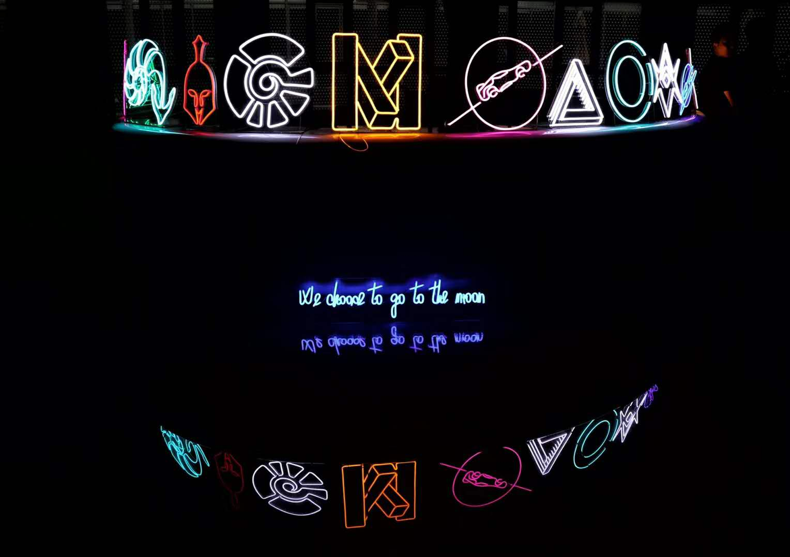
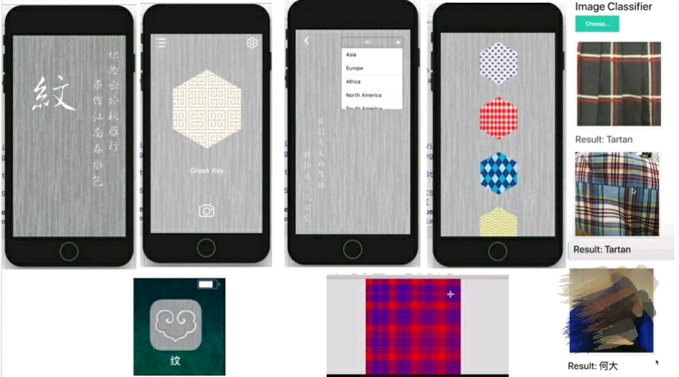

时隔两年，我在高三暑假又一次去上海参加了 TechX 科技峰会，也有了一些新的体会与感触。

TechX 2018 Slogan

<!-- more -->

## 关于课程

这一次我报的课程是深度强化学习，总体来说学的东西还是比较硬核的。比起2016年的 *Machine Learning*，这次的课程更加注重数学推导与算法实现而非 libraries 的应用，诸如 Back Propogation, Q-learning, Multi-armed Bandit 之类的模型和算法都会详细推导并布置相应的编程实现习题。不过进度和内容的确有些太快太深，上完课很多东西还是没有弄懂，因此对于高中生而言难度可能是有些偏高。但反过来讲，吃透了这门课的内容个人认为对机器学习和强化学习也算是初窥门径了，因此这门课还是收获颇多，值得一上。

我把部分课后习题的代码上传到了 [Github](https://github.com/lxywizard/techx-drl-homework)，感兴趣的读者可以看下，但注释和风格都没有注意，见笑了。

Seminars 也听了不少，有一些还是比较有意思，比如 Karen 学姐的自然语言处理和一个密码学相关的学术性很强，有不少干货，Intel 工程大赛中国队员的分享也好好膜拜了一波（同个高中的学妹也在里面orz）。诸如华为区块链的讲座就让我有点昏昏欲睡了，聊天机器人和爬虫什么的也是网上看看教程轻易就可以入门，不过考虑到 TechX 也有挺多零基础的学员，激发他们对技术的兴趣这些东西也更加合适一点，就见仁见智，不做评论了。

## 关于 Hackathon

TechX 2018 的 hackathon 策划的还是比较成功的，从一开始就有各种活动帮助大家策划最后的 hackathon project。我这次的项目是一个识别、介绍、推荐、生成不同文化的代表图案纹理的 IOS app，并且苦逼的选择了自己训练模型（毕竟这种奇葩主题怎么会有 pre-trained model...）果然一开始数据量不够，多亏后来在几个组员拼命人工筛选 Google 爬下来质量堪忧的图片（各位组员真的辛苦了！），我也写了不少 python 脚本来批量做数据增强，弄了5个类别，每个类别几千张图，丢到一个去掉全连接层的基于 ImageNet 的 InceptionV3 模型里。在多次调参之后也达到了超过 95 % 的正确率（虽然实验结果有些过拟合了...）。还好最后 IOS app 做的还算比较好看，成功 carry 我们进入十六强。总而言之这次 hackathon 只能说差强人意，最大的收获就是迁移学习应用和一些调参的技巧了（捂脸）。

hackathon project “纹” demo

具体代码在[这里](https://github.com/lxywizard/TechX-Texture)，其实推荐系统还没有做好，也还没有把生成图案的功能加到 app 里去，但能够做展示的核心代码都在这了（逃

## 一点感想

TechX 是一个充满理想主义的地方，人们可以在这里感受到对科技的最纯粹的热爱，这一点是令我、也是令很多人非常意外的。相对很多所谓的“高水平”夏校而言，TechX 说不上 selective 参加的人水平也良莠不齐，然而它就是可以营造出这种大家都抛开面子，无论问题简单与否，都积极不耻下问；无论 idea 是否看上去 naive，都能放上台面上来讨论的开放的氛围，这些都是我们以往很少能看见的。关于这点，我也在知乎上写了一个[非常感性的答案](https://www.zhihu.com/question/60409263/answer/464998561)（想看感想的话这个答案干货比此文多得多）。

现在过去了这么久也可以更为理性的审视 TechX，当然创立 TechX 的初衷是否真的如同所宣传的那样理想化我们也不得而知，我也并没有因为 TechX 而整个人就变得理想主义起来。但 TechX 的经历确实给了我相当大的感触，因此这个活动也给了我一个审视自己未来道路的契机，在理想和现实之间到底如何抉择。无论如何，不管在 TechX 之外大家是怎么样的，如果各位心中尚有着对纯粹交流科技的渴望，都尽管可以来参加，因为至少在 TechX 的十天里，确实能够给大家一个相当完美的理想主义氛围。